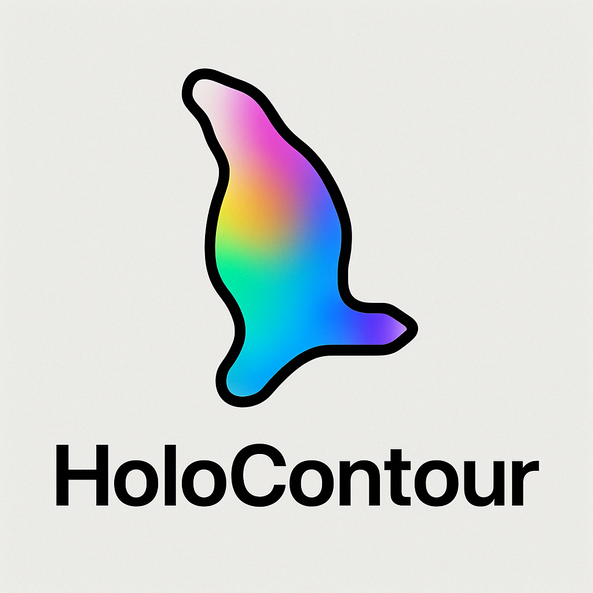
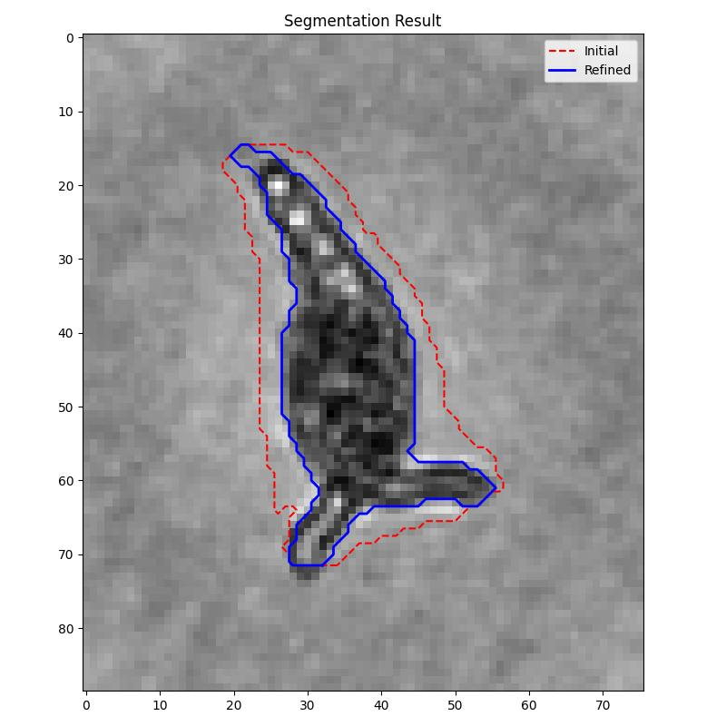

  
  

    
A minimalist tool for holographic plankton image segmentation.

  

# HoloContour

This repository provides a pipeline for segmenting holographic particle images using a hybrid region-growing and contour refinement method. It integrates with the [MorphoCut](https://github.com/morphocut/morphocut) framework and exports outputs compatible with [EcoTaxa](https://ecotaxa.obs-vlfr.fr/).

---

## 🚀 Features

- Contour-based object detection with:
  - Intensity filtering
  - Histogram matching (optional)
  - Region growing from intensity minima
- Optional plot saving of initial vs. refined masks
- Compatible with `EcoTaxaWriter`
- YAML-based configuration
- Safe fallback for empty masks

---

## 🖼 Example

The figure below shows an example of the pipeline's segmentation output:
  

  

- **Red dashed**: Initial region estimate
- **Blue solid**: Refined segmentation contour

---
## License

This project is licensed under the MIT License - see the [LICENSE](LICENSE) file for details.

---

